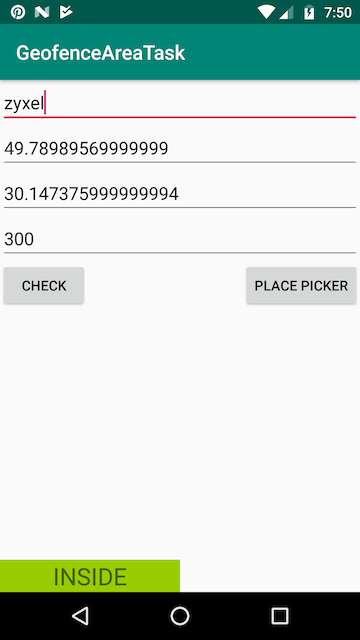
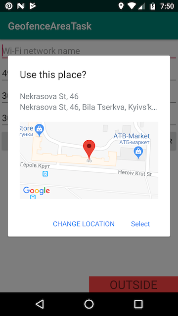

# Geofence Area Detector

Android application that detect if the device is located inside of a geofence area.

Geofence area is defined as a combination of some geographic point, radius, and specific Wifi network name. A device is considered to be inside of the geofence area if the device is connected to the specified WiFi network or remains geographically inside the defined circle.

## Instructions

To configure geofence area enter Wi-Fi network name and/or circular region (latitude, longitude, radius in meters).
To choose a place on Google Maps press PLACE PICKER button.
To start geofence area detection press CHECK button. You can see INSIDE/OUTSIDE status at the bottom.

Latitude: between -90 and +90 degrees inclusive.
Longitude: between -180 and +180 degrees inclusize.

&nbsp;&nbsp;&nbsp;&nbsp;

## Monitoring geofences

The geofence service doesn't continuously query for location, so expect some latency when receiving alerts. Usually the latency is less than 2 minutes, even less when the device has been moving. If Background Location Limits are in effect, the latency is about 2-3 minutes on average. If the device has been stationary for a significant period of time, the latency may increase (up to 6 minutes).
To read more go to [https://developer.android.com/training/location/geofencing](https://developer.android.com/training/location/geofencing).

## Architecture

Application is based on [Android Architecture Components](https://developer.android.com/topic/libraries/architecture/) (ViewModel, LiveData, etc.) that are part of [Android Jetpack](https://developer.android.com/jetpack/).

## Upcoming features

Room for internal storage, Dagger for dependecy injection, two-way databinding and Unit/UI tests.